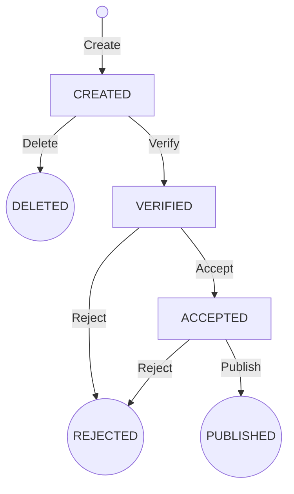

# Request Management Application

A REST API for managing requests through a defined lifecycle.

The application was created as a recruitment assignment and demonstrates a Spring Boot implementation for backend service that manages the lifecycle of requests.

## Features

The application supports requests operations:

- Creating requests
- Updating request body
- Deleting requests
- Verifying requests
- Accepting requests
- Rejecting requests
- Publishing requests
- Browsing requests with pagination
- Filtering requests by name and state
- Maintaining a complete request audit history

## Request Lifecycle

Every request starts in the `CREATED` state.

The supported state transitions are:



The following transitions are allowed:

| Current state | Operation | New state |
|---|---|---|
| `CREATED` | Delete | `DELETED` |
| `CREATED` | Verify | `VERIFIED` |
| `VERIFIED` | Accept | `ACCEPTED` |
| `VERIFIED` | Reject | `REJECTED` |
| `ACCEPTED` | Reject | `REJECTED` |
| `ACCEPTED` | Publish | `PUBLISHED` |

Any attempt to perform an operation that is not allowed for the current state results in an error response.

### Request Body Modification

The request body can only be modified while the request is in one of the following states:

- `CREATED`
- `VERIFIED`

Updating the body does not change the request state.

However, body modifications are recorded in the audit history to preserve a complete history of relevant changes made to the request.

## Technology Stack

- Java 25
- Spring Boot 4.1.1
- Spring Web MVC
- Spring Data JPA
- Hibernate
- Jakarta Validation
- H2 Database
- Lombok
- JUnit 5
- Mockito
- AssertJ
- Spring MockMvc
- springdoc-openapi / Swagger UI
- Maven

## Architecture

The application follows a layered structure with responsibilities separated between the REST API, business logic, persistence, and mapping layers.

```text
Controller
    │
    ▼
Service
    │
    ├── Repository
    │
    ├── PublicationIdentifierGenerator
    │
    └── Mapper
            │
            ▼
           DTO
```

The main responsibilities are:

- **Controller** — exposes the REST API and handles HTTP input and output.
- **Service** — contains request lifecycle rules and business logic.
- **Repository** — provides persistence through Spring Data JPA.
- **Entity** — represents persistent application data.
- **DTO / Request / Response** — define API data structures without exposing persistence entities directly.
- **Mapper** — converts between persistence entities and API DTOs.
- **PublicationIdentifierGenerator** — abstracts publication identifier generation.

## Running the Application

### Prerequisites

- JDK 25
- Maven

Clone the repository:

```bash
git clone git@github.com:mradecki-devire/RequestManagementApplication.git
cd RequestManagementApplication
```

Run the application using Maven:

```bash
mvn spring-boot:run
```

Alternatively, the application can be started directly from an IDE such as IntelliJ IDEA.

By default, the application starts on:

```text
http://localhost:8080
```

## API Documentation

Interactive API documentation is available through Swagger UI after starting the application:

```text
http://localhost:8080/swagger-ui.html
```

The generated OpenAPI specification is available at:

```text
http://localhost:8080/v3/api-docs
```

Swagger UI can also be used to execute and test the API endpoints.

## API Endpoints

| Method | Endpoint | Description |
|---|---|---|
| `POST` | `/create` | Creates a new request |
| `DELETE` | `/{requestId}` | Deletes a request |
| `POST` | `/verify/{requestId}` | Verifies a request |
| `POST` | `/accept/{requestId}` | Accepts a request |
| `POST` | `/reject/{requestId}` | Rejects a request |
| `POST` | `/publish/{requestId}` | Publishes a request |
| `PUT` | `/update/{requestId}` | Updates the request body |
| `GET` | `/browse` | Returns a paginated and optionally filtered list of requests |
| `GET` | `/auditlog/{requestId}` | Returns the audit history of a request |

Detailed request and response schemas are available in Swagger UI.

## Browsing Requests

Requests can be browsed using:

```http
GET /browse
```

Pagination is supported through the following query parameters:

| Parameter | Required | Default | Description |
|---|---|---|---|
| `page` | No | `0` | Zero-based page number |
| `size` | No | `10` | Number of requests per page |
| `name` | No | — | Filters requests by name |
| `state` | No | — | Filters requests by state |

For example:

```http
GET /browse?page=0&size=10&state=VERIFIED
```

Requests can be filtered by:

- name,
- state,
- both name and state.

Results are explicitly ordered by `requestId` in ascending order to provide deterministic pagination.

## Audit Log

The application maintains a complete history of relevant request changes.

An audit entry is created when:

- a request is created,
- the request state changes,
- the request body is updated.

Each audit entry represents a snapshot of the request at a particular point in time and contains:

- Request identifier
- Name
- Body
- State
- Reason
- Publication identifier
- Timestamp of the change

The audit history can be retrieved using:

```http
GET /auditlog/{requestId}
```

Entries are returned chronologically by the `changedAt` timestamp.

### Body Updates in the Audit Log

Updating a request body does not cause a state transition.

However, a new audit entry is intentionally created when the body changes, even though the state remains unchanged.

For example, the history could contain:

```text
10:00  CREATED   body="Initial body"
10:15  CREATED   body="Updated body"
10:30  VERIFIED  body="Updated body"
11:00  ACCEPTED  body="Updated body"
```

The second entry does not represent a state transition. It represents a body modification while the request remained in the `CREATED` state.

This behavior is intentional because body modifications are considered relevant changes to the request and should remain traceable.

As a result, audit records represent request snapshots at relevant points in the lifecycle rather than only state transitions.

## Publication Identifier

When an `ACCEPTED` request is published:

1. A publication identifier is generated using the `PublicationIdentifierGenerator` abstraction.
2. The identifier is assigned to the request.
3. The request state changes to `PUBLISHED`.
4. The change is recorded in the audit history.

The publication identifier is represented as a `String` containing only numeric characters.

The persistence model additionally enforces uniqueness at the database level:

```java
@Column(name = "publication_identifier", unique = true)
private String publicationIdentifier;
```

This provides an additional persistence-level safeguard against duplicate publication identifiers.

The generation mechanism is hidden behind the following abstraction:

```java
public interface PublicationIdentifierGenerator {

    String generate();
}
```

The request service therefore does not depend on a specific identifier generation strategy.

## Concurrency

`RequestEntity` uses JPA optimistic locking:

```java
@Version
private Long version;
```

Optimistic locking protects requests against lost updates when multiple transactions attempt to modify the same request concurrently.

When a request is read, its current version is also loaded. During an update, Hibernate verifies that the version has not changed in the meantime.

If another transaction has already modified the same request, the update cannot silently overwrite the newer data.

Lifecycle-changing operations are also executed transactionally.

For example, changing a request state and inserting its corresponding audit entry belong to the same transaction. If the operation fails, neither change should be committed.

## Validation

Input data is validated using Jakarta Bean Validation.

Validation is performed at the REST API boundary using `@Valid`.

The service is additionally annotated with:

```java
@Validated
```

allowing validation to also be applied at the service layer where required.

A request cannot be created with invalid required fields, and operations requiring a reason validate the corresponding input before executing business logic.

## Error Handling

The application uses dedicated exceptions to represent business errors.

Examples include:

- Request not found
- Operation not permitted for the current request state
- Invalid request input

State transitions are explicitly validated before modifying the request.

For example, publishing is only allowed for an `ACCEPTED` request. Attempting to publish a request in any other state results in an error rather than an invalid state transition.

## Persistence

The application uses Spring Data JPA and Hibernate.

H2 is used as the database to make the project easy to run without requiring external infrastructure.

### RequestEntity

`RequestEntity` represents the current state of a request.

It contains:

- Request ID
- State
- Name
- Body
- Reason
- Publication identifier
- Optimistic locking version

The entity represents the latest state of the request.

### RequestStateHistoryEntity

`RequestStateHistoryEntity` represents a historical snapshot of a request.

It contains:

- Request ID
- Name
- Body
- Reason
- Publication identifier
- State
- Timestamp

Unlike `RequestEntity`, historical records are not updated when the request changes. Instead, another history entry is inserted.

This provides an append-only audit trail from the application's perspective.

## Design Decisions & Assumptions

### DTOs Instead of Exposing JPA Entities

REST endpoints return DTOs rather than exposing JPA entities directly.

This separates the external API contract from the persistence model.

Changes to persistence-specific fields therefore do not automatically become changes to the public REST API.

### Publication Identifier Abstraction

Publication identifier generation is hidden behind:

```java
PublicationIdentifierGenerator
```

`RequestService` depends on the abstraction rather than on a particular generation algorithm.

A concrete implementation is selected through Spring dependency injection.

This makes the generation strategy:

- replaceable,
- independently testable,
- independent from request lifecycle logic.

### Database-Level Publication Identifier Uniqueness

Publication identifiers are generated by the configured `PublicationIdentifierGenerator`.

Uniqueness is additionally enforced through a database `UNIQUE` constraint.

The database therefore provides the final persistence-level protection against storing duplicate publication identifiers.

### Optimistic Rather Than Pessimistic Locking

Requests use optimistic locking through JPA's `@Version`.

This approach assumes that concurrent updates to the same request are relatively uncommon.

Optimistic locking avoids holding database locks during normal request processing while still detecting conflicting modifications.

### Audit History as Request Snapshots

The original audit requirement focuses on preserving request state history.

The implementation deliberately goes slightly further and also records request body modifications.

Updating the body does not change the request state, but it creates a new audit entry containing the current state and updated body.

This was an intentional design decision to provide better traceability of request modifications.

Audit records therefore represent snapshots of the request at relevant points in its lifecycle rather than only state transitions.

### Deterministic Pagination

Browsing requests uses explicit sorting:

```java
Sort.by("requestId").ascending()
```

Pagination without explicit ordering does not guarantee deterministic record ordering.

Sorting by request identifier ensures that repeated requests for consecutive pages operate on a well-defined ordering.

### In-Memory Database

H2 was selected to make the application easy to run and evaluate without requiring external database infrastructure.

The persistence layer uses JPA, limiting coupling between business logic and the selected database.

### State Transition Validation

Allowed state transitions are explicitly validated before changing request state.

The application does not allow arbitrary state assignment through the REST API.

For example:

```text
CREATED -> VERIFIED
```

is valid, while:

```text
CREATED -> PUBLISHED
```

is not.

Invalid operations result in business exceptions.

### Transaction Boundaries

Operations modifying an existing request are transactional.

A request modification and its corresponding audit entry therefore form a single logical operation.

For example:

```text
ACCEPTED
    │
    │ publish
    ▼
PUBLISHED
+
audit entry
```

should either be persisted together or rolled back together if the operation fails.

## Testing

The project contains automated tests using:

- JUnit 5
- Mockito
- AssertJ
- Spring MockMvc

Tests cover service-level business behavior as well as REST API behavior.

Run all tests with:

```bash
mvn test
```

## Possible Improvements

Given more development time, possible improvements include:

- Moving state transition rules into a dedicated domain model
- Replacing repeated lifecycle validation with a centralized state transition mechanism
- Renaming `RequestStateHistoryEntity` to `RequestHistoryEntity` to better reflect that body modifications are also audited
- Adding database migrations using Flyway or Liquibase
- Adding integration tests against a production-grade database using Testcontainers
- Adding structured application logging and observability
- Adding configurable pagination limits
- Adding authentication and authorization if required by the API

## Author

**Michał Radecki**  
**Email:** michal.radecki.dev@gmail.com  
**Date:** August 2026

## Copyright

Copyright © 2026 Michał Radecki. All rights reserved.

This project was created as part of a recruitment assignment.  
The source code is provided for evaluation and demonstration purposes only.  
Reuse, redistribution, or commercial use without the author's permission is not permitted.